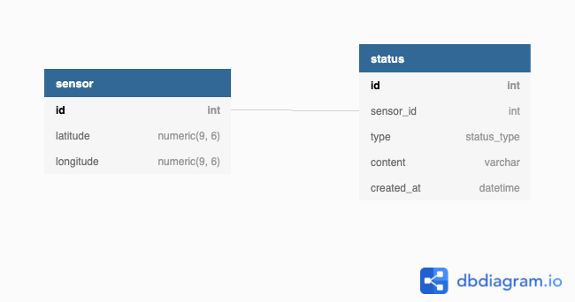

# Answers

## Database

I am familiar with relational databases (PostgreSQL, MySQL) and MongoDB as a NoSQL database. I considered these two solutions. I think both should be more or less suitable for these requirements.

For the MongoDB solution, I would use one collection which contains both the sensor's data and the logins.

This would be the schema I would use:
```
{
    _id: ObjectID,
    sensor_id: Number,
    location: {
        type: "Point",
        coordinates: [longitude, latitude]
    },
    logins: [
        {
            created_at: Timestamp,
            type: "status" | "error",
            content: String[]
        }
    ]
}
```

The main benefit of this solution is that the schema is easily extendable. Because the logins are stored inside the sensor object there is no need to write joins with other tables.

The main problem is the maximum size of one document is 16 megabytes. A login object as a JSON file takes about 90 bytes. This means only 187000 (16 * 1024 * 1024 / 90) login can be inserted into a sensor. If there is one login per minute it means the document would be full in 130 days or 2 days if there is a login every second.

Storing the logins in a different collection would solve this problem. However, this would lead to a referenced relationship which results in using multiple queries.

As the system should be able to handle this amount of data I thought multiple tables are needed to store the information. I choose a relational database for a solution as its purpose is to map the connection between tables.

I tried to have the simplest solution so my database looks like this:



There is a one-to-many relationship between the sensor and the status table. The status_type enum contains two values: "status" and "error". I also added an SQL file that contains simple queries for the given requirements.


## API

### Describe a solution that would allow you to get the updated status of each sensor in realtime. Give as much justification as possible on why you decided on this solution, and notanother one.

I would use a WebSocket connection for this. The sensor could connect to this server and send data. As this is a two-way connection it is possible to request data from sensors. If one of the sensor disconnect it could indicate there is a problem with it. As an exact solution, I would use socket.io as this covers edge cases and I am familiar with it.

### Describe which technique you would use to limit access to the API, and limit the numberof requests ?

Unfortunately, I don't have much experience with access and request limiting. After doing some research I would use some kind of request queueing solution for example Amazon Simple Queue Service. If a custom method is required I would use the leaky bucket algorithm with a load balancer.

### Describe a solution that would allow third-party to be able to build applications (eitherweb or mobile) based on the sensor data normally accessible for your users.

I would create a service to generate API keys and to authenticate requests from a different origin. The API key should be included in the header of each request. This would also allow monitoring the usage of each user.